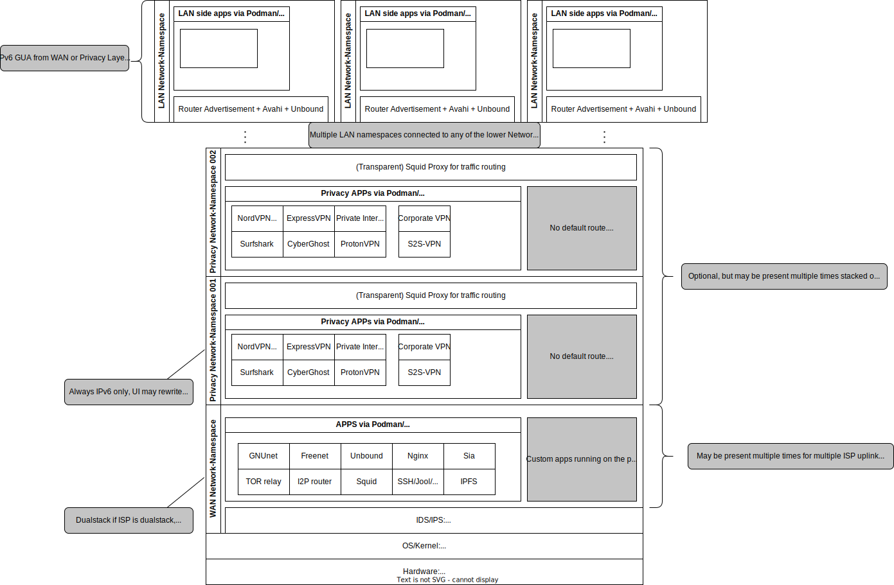

# Build-A-Router

This project is about building a new innovative CPE-router for prosumers. After the decline of AVM Fritz!Box as the goto prosumer device and their stagnation in development of new features it is time for a new product.

## Features

* RAM: 4 GB
* NAND: 256GB
* Kernel: Mainline, always the most recent, secure and feature richest kernel directly build from mainline
* Alpine Linux as base OS that is "designed for power users who appreciate security, simplicity and resource efficiency"
* IPv6 first design for a modern network
* IPv6-only on internal networks
* Jool for NAT64 and NAT46 (port forwardings)
* Dualstack on public interface
* Site2Site-VPN
* Client2Site-VPN (road warrior VPN)
* Privacy VPN
* IDS + IPS built-in
* Podman for user extendability with custom apps.
* Root access optional (will trigger a flag in UI)
* Unbound recursive DNS resolver
* Zeroconf
* Squid3 (transparent) proxy
* Multi WAN compatible
* Modular design
* Low power consumption
* Slim form factor (Mini-ITX, ...)
* Multi Site deployment (share configuration over Site2Site VPN link)
* SFP+ Slots (or bundled media converters) for VDSL, DOCSIS, Fiber, ...
* PoE In/Out
* 2.5GBASE-T or 5GBASE-T
* >4 Ethernet Ports
* TPM for secure and transparent system encryption
* RTC (maybe integrated into GPS/5G module)

## Architecture

